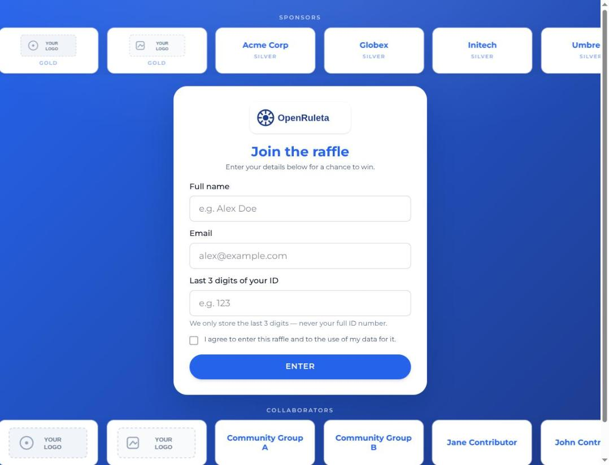
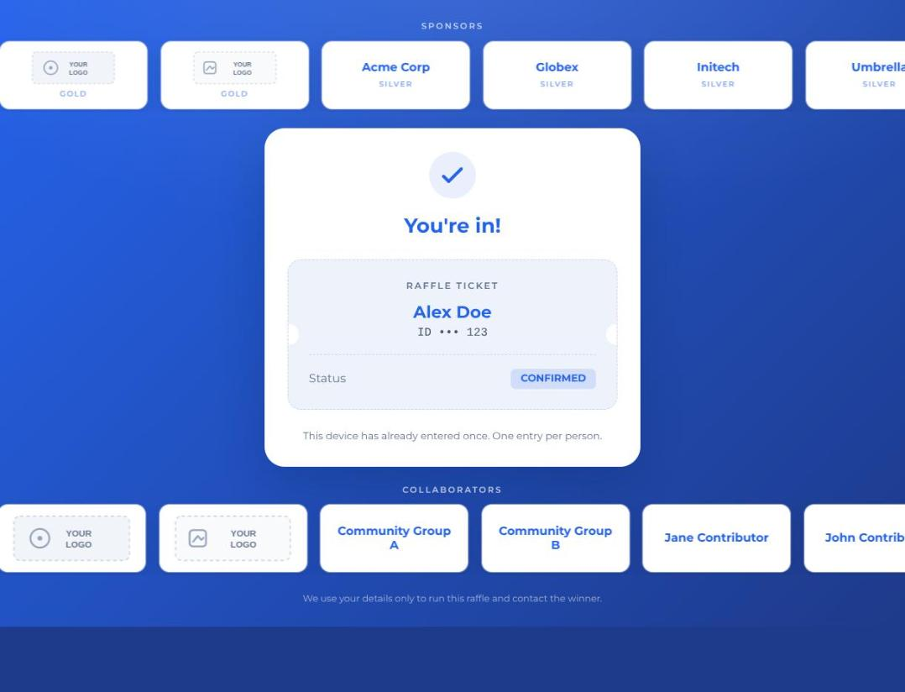
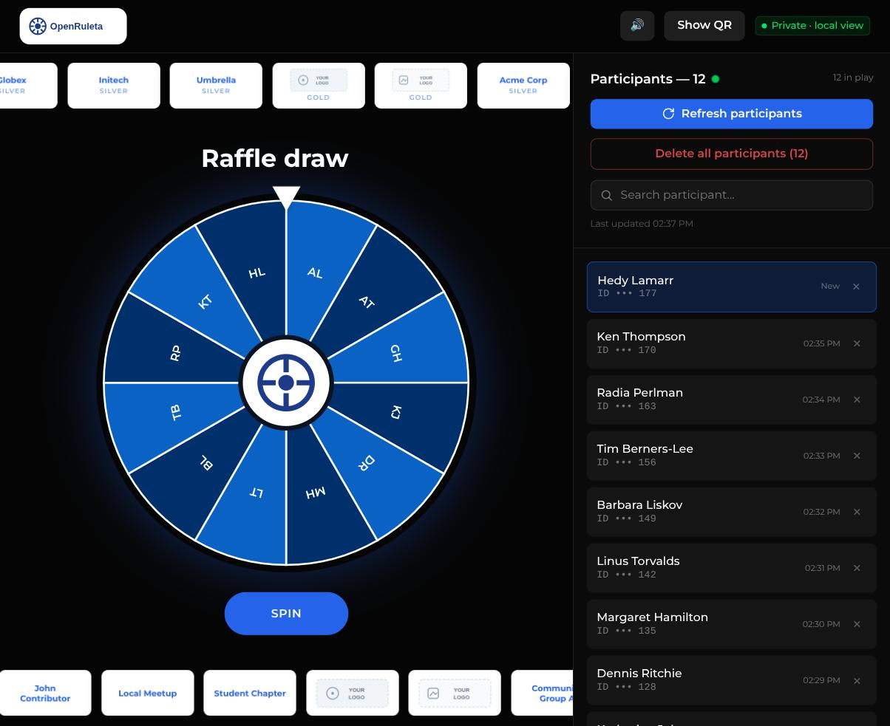
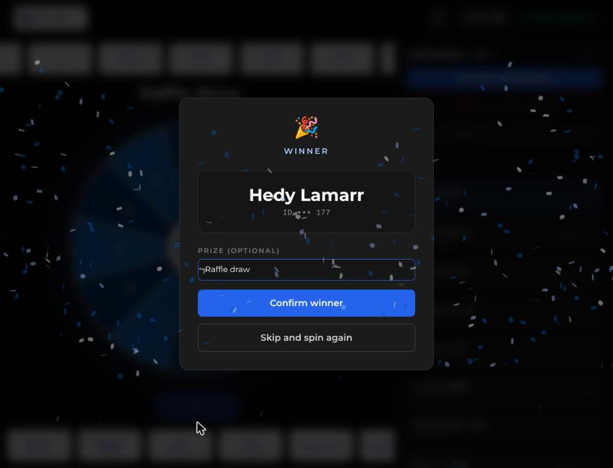

# OpenRuleta

A self-hostable raffle toolkit, backed by Supabase. Two small Next.js apps that
share one database:

- **`apps/form`** — a public, single-screen sign-up form. Share it by QR code;
  people enter their details from their phone and they're in the draw. Deploy it
  anywhere (Vercel, Netlify, a VPS).
- **`apps/ruleta`** — a winner-picker wheel for whoever runs the draw. Spin it,
  assign a prize, mark winners (they stay out of later spins), export a CSV.
  Run it on your laptop, or host it behind a password.

> Built for and used live at **Data Saturday LATAM Argentina 2026**: ~300
> attendees signed up from their phones during the event while the wheel drew
> winners on stage, all against a single free-tier Supabase project.
>
> This repo is the generic, de-branded version. The default event name, copy,
> colours, sponsor/collaborator lists and logos are placeholders — make them
> yours in one file (see [Make it yours](#make-it-yours)).

## Screenshots

|          Sign-up form          |              "You're in" ticket              |
| :----------------------------: | :------------------------------------------: |
|  |  |

|          Winner wheel           |      Winner + prize (pre-filled)       |
| :-----------------------------: | :------------------------------------: |
|  |  |

The prize field is pre-filled with the current wheel title, so whoever runs the
draw doesn't retype what's being raffled.

## Stack

Next.js 16 (App Router) · React 19 · TypeScript · Tailwind CSS v4 · pnpm
workspaces · Supabase (`@supabase/supabase-js`). No other runtime services.

```
apps/
  form/      public sign-up form            (anon key, deploy it)
  ruleta/    winner-picker wheel            (service_role key, local or gated)
packages/
  config/    @openruleta/config  — ALL branding, copy and event data
  core/      @openruleta/core    — types, validation, Supabase client, DB ops
  ui/        @openruleta/ui      — shared React bits + Tailwind theme tokens
supabase/
  schema.sql one authoritative schema for both apps
```

## Setup

You need Node 20+, [pnpm](https://pnpm.io) 9+, and a Supabase project.

### 1. Install

```bash
git clone https://github.com/LorenGrz/OpenRuleta
cd OpenRuleta
pnpm install          # once, at the repo root — it's a pnpm workspace
```

### 2. Create the database

Create a Supabase project (the free tier is plenty), then apply the schema:
open **SQL Editor**, paste the contents of [`supabase/schema.sql`](supabase/schema.sql),
and run it. It creates one table, `public.participants`, plus the row-level
security policies the two apps rely on.

### 3. Environment variables

Next.js loads `.env.local` from **each app's own directory**. Copy the examples
and fill them from **Supabase → Project Settings → API**:

```bash
cp apps/form/.env.example   apps/form/.env.local
cp apps/ruleta/.env.example apps/ruleta/.env.local
```

| Var                         | form | ruleta | Value                                      |
| --------------------------- | :--: | :----: | ------------------------------------------ |
| `NEXT_PUBLIC_SUPABASE_URL`  |  ✅  |   ✅   | Project URL                                |
| `SUPABASE_ANON_KEY`         |  ✅  |        | `anon` / publishable key                   |
| `SUPABASE_SERVICE_ROLE_KEY` |      |   ✅   | `service_role` key (server-side only)      |
| `RULETA_BASIC_AUTH`         |      |  opt.  | `user:password` — set only when hosting it |

### 4. Run

```bash
pnpm dev:form     # → http://localhost:3000
pnpm dev:ruleta   # → http://localhost:3100   (in a second terminal)
```

Open the form, sign up a few test people, then open the wheel and spin.

## Deploying the form for a real event

`apps/form` is the deployable half. On **Vercel**:

1. Import the repo. Set **Root Directory** to `apps/form`.
2. Add `NEXT_PUBLIC_SUPABASE_URL` and `SUPABASE_ANON_KEY` as environment
   variables.
3. Deploy. `apps/form/vercel.json` registers a daily cron hit to `/api/ping` so
   the free-tier Supabase project doesn't get paused for inactivity.
4. Generate a QR code pointing at the deployed URL and put it on a slide.

The anon key can only `INSERT` into `participants` (enforced by RLS in
`schema.sql`), so it is safe to ship in a public deployment.

During the event, run `apps/ruleta` locally against the **same** Supabase
project — it picks up new sign-ups automatically (it polls every few seconds).

## Running the wheel: local or hosted

`apps/ruleta` uses the **service_role key**, which bypasses Row Level Security,
so its API can read, update and delete every participant. By default it is
**not authenticated**. You choose:

- **Local (default).** `pnpm dev:ruleta`, or build and `pnpm --filter
@openruleta/ruleta start`. Leave `RULETA_BASIC_AUTH` unset. Nothing is
  exposed — simplest for a draw run from a laptop.
- **Hosted.** Set `RULETA_BASIC_AUTH="user:password"` in the deployment
  environment (plus the two Supabase vars). `apps/ruleta/src/proxy.ts` then
  challenges **every** request — pages and API — with HTTP Basic Auth, so the
  service_role-backed routes are never open on the public URL. Use a strong
  password; add your host's rate limiting or an IP allow-list on top if you can.

Do not host the wheel without `RULETA_BASIC_AUTH` set.

## Make it yours

Everything user-facing lives in **one file**:
[`packages/config/src/index.ts`](packages/config/src/index.ts). Event name, all
copy (English by default — translate it there), the ID/document field rules, the
sponsor and collaborator lists, wheel timing, confetti colours, CSV columns.

Two things sit outside it on purpose:

- **Colours** — `packages/ui/src/theme.css` (Tailwind v4 `@theme` variables).
- **Font** — the `next/font/google` import in each app's `src/app/layout.tsx`
  (a compile-time API), plus `--font-sans` in `theme.css`.

Replace the placeholder art in `apps/*/public/` (`logo.svg`, `icon.svg`,
`logos/*.svg`, and `apps/ruleta/public/poster.svg`) with your own.

## How the data works

One table, `public.participants`. The form inserts `name` / `email` /
`doc_last3`; a unique index on `lower(email)` rejects duplicates with a `409`.
The wheel sets `won_at` and `prize` on winners so they stay excluded across
spins; "reset draw" clears them. The wheel resolves a spin against a frozen copy
of the list, and pauses polling while it spins or a modal is open, so a
background refresh can't shift the result mid-animation.

## Commands

```bash
pnpm dev:form   ·  pnpm dev:ruleta
pnpm build      ·  pnpm lint  ·  pnpm typecheck  ·  pnpm test
pnpm format
```

`build` / `lint` / `typecheck` / `test` run across every workspace.

## License

MIT — see [`LICENSE`](LICENSE).
